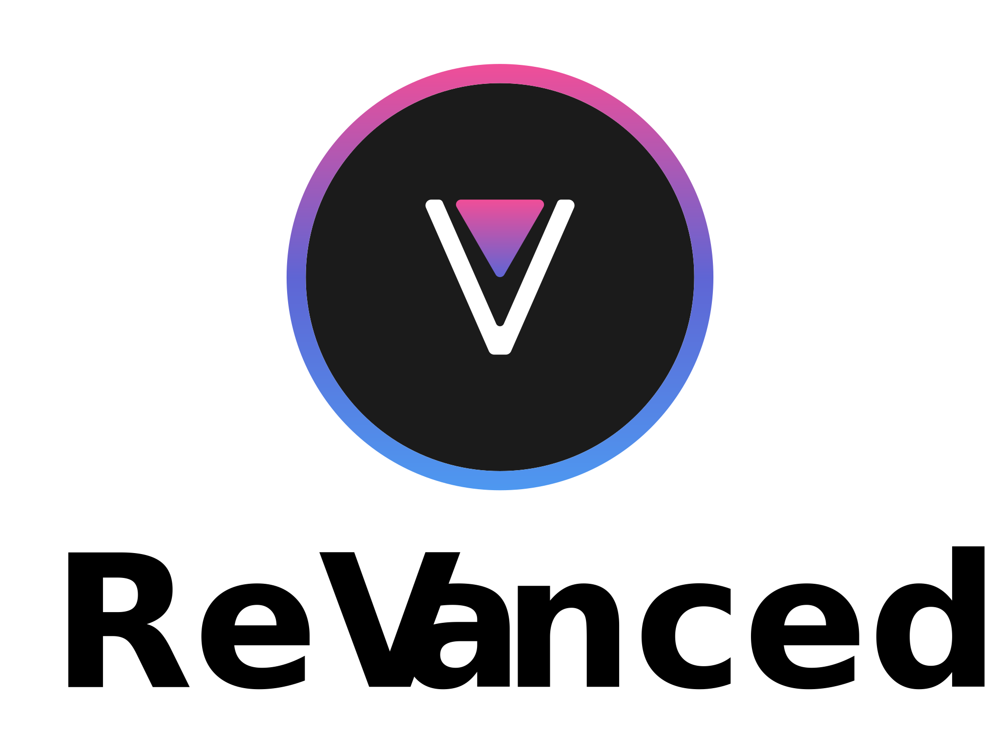
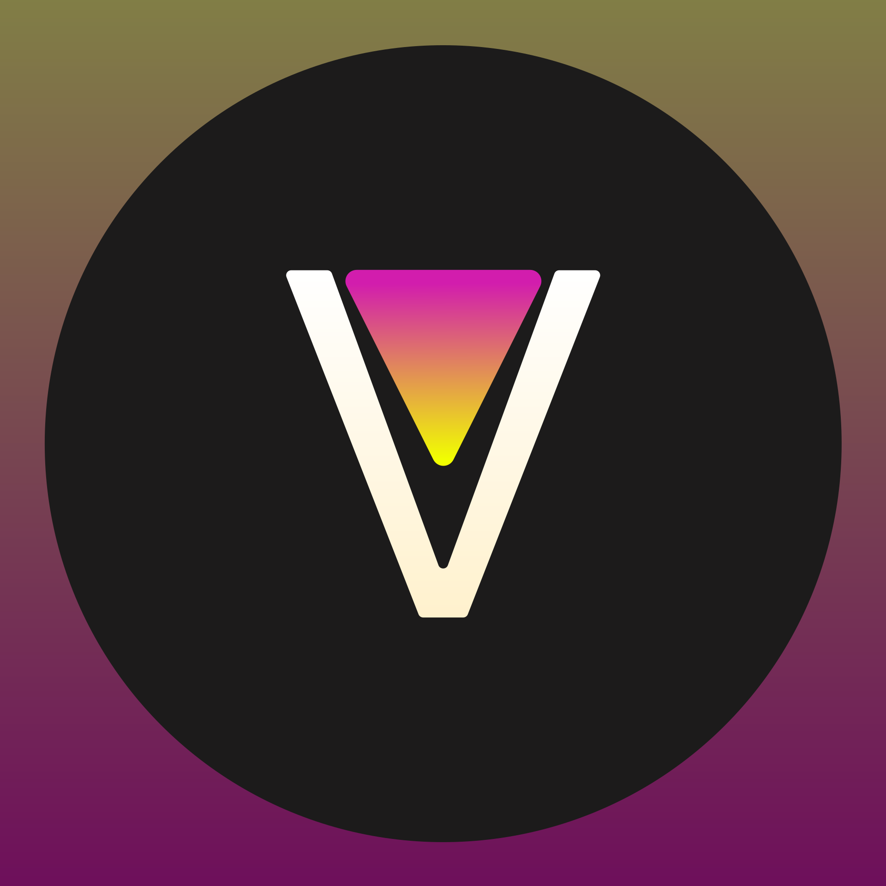

  <picture>
    <source
      width="256px"
      media="(prefers-color-scheme: dark)"
      srcset="assets/revanced-headline/revanced-headline-vertical-dark.svg"
    >
    
  </picture>
   
  <a href="https://revanced.app/">
     <picture>
         <source height="24px" media="(prefers-color-scheme: dark)" srcset="assets/revanced-logo/revanced-logo.svg" />
         
     </picture>
   </a>&nbsp;&nbsp;&nbsp;
   <a href="https://github.com/ReVanced">
       <picture>
           <source height="24px" media="(prefers-color-scheme: dark)" srcset="https://i.ibb.co/dMMmCrW/Git-Hub-Mark.png" />
           
       </picture>
   </a>&nbsp;&nbsp;&nbsp;
   <a href="http://revanced.app/discord">
       <picture>
           <source height="24px" media="(prefers-color-scheme: dark)" srcset="https://user-images.githubusercontent.com/13122796/178032563-d4e084b7-244e-4358-af50-26bde6dd4996.png" />
           
       </picture>
   </a>&nbsp;&nbsp;&nbsp;
   <a href="https://reddit.com/r/revancedapp">
       <picture>
           <source height="24px" media="(prefers-color-scheme: dark)" srcset="https://user-images.githubusercontent.com/13122796/178032351-9d9d5619-8ef7-470a-9eec-2744ece54553.png" />
           
       </picture>
   </a>&nbsp;&nbsp;&nbsp;
   <a href="https://t.me/app_revanced">
      <picture>
         <source height="24px" media="(prefers-color-scheme: dark)" srcset="https://user-images.githubusercontent.com/13122796/178032213-faf25ab8-0bc3-4a94-a730-b524c96df124.png" />
         
      </picture>
   </a>&nbsp;&nbsp;&nbsp;
   <a href="https://x.com/revancedapp">
      <picture>
         <source media="(prefers-color-scheme: dark)" srcset="https://user-images.githubusercontent.com/93124920/270180600-7c1b38bf-889b-4d68-bd5e-b9d86f91421a.png">
         
      </picture>
   </a>&nbsp;&nbsp;&nbsp;
   <a href="https://www.youtube.com/@ReVanced">
      <picture>
         <source height="24px" media="(prefers-color-scheme: dark)" srcset="https://user-images.githubusercontent.com/13122796/178032714-c51c7492-0666-44ac-99c2-f003a695ab50.png" />
         
     </picture>
   </a>
    
    
   Continuing the legacy of Vanced

# 🖌️ ReVanced brand guidelines

This repository contains guidelines, kits, and other assets to help you use ReVanced's core brand elements.

## ©️ Copyright notice

The ReVanced project is open-source and distributed under the GNU General Public License (GPL), however the **ReVanced name, logo, and brand identity are copyrighted assets** and **not** covered by the GPL license.

To use any part of the ReVanced brand, you must obtain explicit **written permission** by contacting branding@revanced.app.

Permission to use ReVanced brand assets is granted via a GPG-signed certificate. This certificate may include the public key of the authorized entity, the asset covered, scope of use, and expiration date. To verify a brand permission certificate, refer to [this](https://github.com/ReVanced/revanced-documentation/blob/82259bc674e11541a94ef7d762d2b78b7dcd5c4e/docs/revanced-internals/trust.md#verifying-certificates).

## 🖼️ ReVanced logo

### 🚩 The basics

The ReVanced logo is the most recognizable asset, which is why it is important to follow certain rules when used:

- Do not alter, rotate, or modify the logo. Exceptions apply below
- Do not animate the logo
- Use the latest revision of the logo available at all time

### 🎨 Colors

The ReVanced logo has a triadic gradient that defines its character. The ring as well as the logo feature a top-to-bottom gradient blending the colors  `#F04E98`,  `#5F65D4`, and  `#4E98F0` on the background color  `#1B1B1B`.

The ReVanced logo should appear in single shades of black and white, but the diamond may appear in any color. A light shade and vice versa should be used on a dark background.

### 📏 Spacing

The ReVanced logo should have a minimum margin of 15% of its original size. If a headline accompanies the logo, the margin of the logo and headline should be increased together.

### ☝️ Headline

The ReVanced logo should be accompanied by a headline of any typeface, preferably [Manrope](assets/revanced-typeface/manrope), starting with the [wordmark](assets/revanced-wordmark) on the right or below the logo only.

The headline should appear in single shades of black and white. A light shade and vice versa should be used on a dark background. The full ReVanced logo should be used with a headline.

### 🌐 Socials

Any border-radius may be used for the ReVanced logo.

### ❌ Misuse

- Don't add additional gradients
- Don't add special effects
- Don't change orientation
- Don't add drop shadows
- Don't add additional elements
- Don't add patterns or textures
- Don't skew, rotate, or stretch
- Don't change color
- Don't accompany the logo with a headline starting with anything other than the wordmark
- Don't overemphasize the logo
- Don't place the logo or a variant on a background with low contrast

## 🔤 ReVanced marks

The ReVanced marks include but are not limited to

- The ReVanced name
- The ReVanced logo
- Anything that includes ReVanced in the name

> [!IMPORTANT]
> No letter except R and V in "ReVanced" should be capitalized.

## 📜 ReVanced tagline

The following taglines should be used whenever a slogan, summary, or short description of ReVanced is required:

- "Continuing the legacy of Vanced"
- "Continuing the legacy of Vanced at revanced.app"

> [!NOTE]
> The tagline may end with punctuation when necessary.
