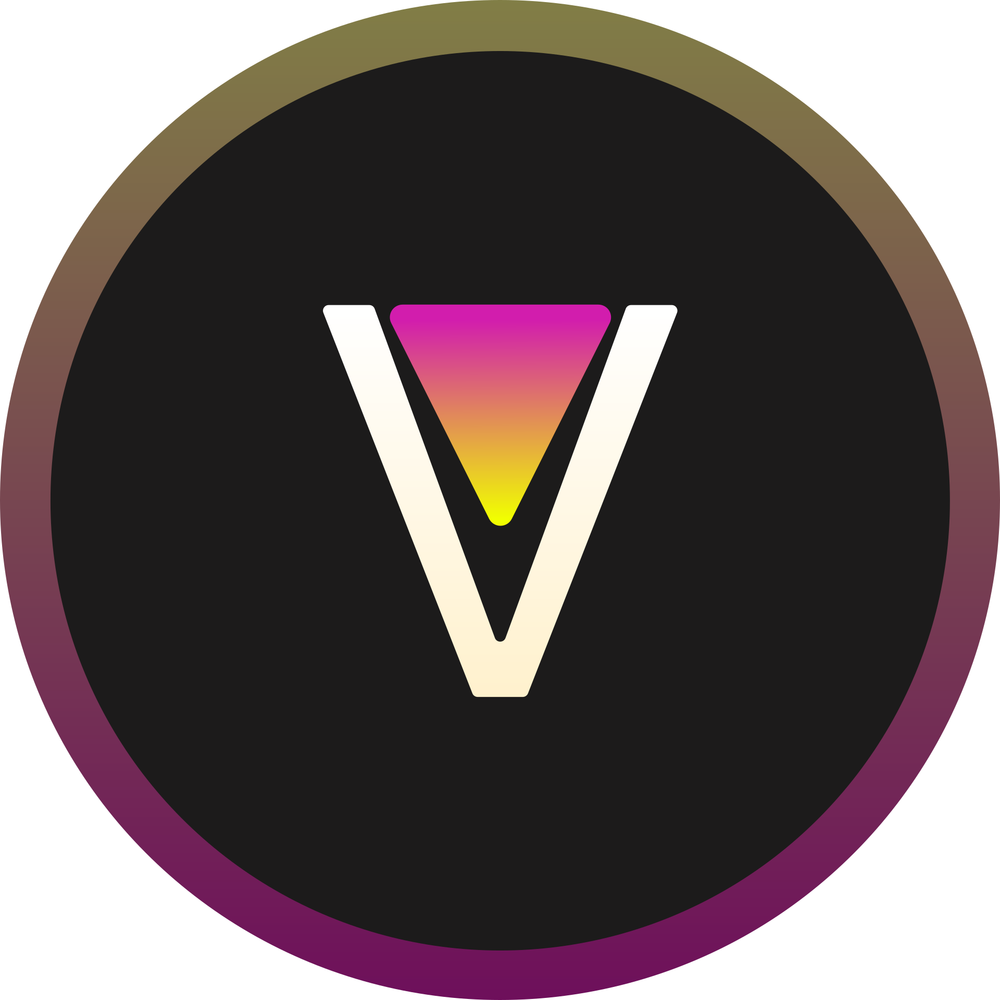

  <picture>
    <source
      width="256px"
      media="(prefers-color-scheme: dark)"
      srcset="assets/revanced-headline/revanced-headline-vertical-dark.svg"
    >
    
  </picture>
   
  &nbsp;&nbsp;&nbsp;
   <a href="https://github.com/revanced">
       <picture>
           <source height="24px" media="(prefers-color-scheme: dark)" srcset="https://i.ibb.co/dMMmCrW/Git-Hub-Mark.png" />
           
       </picture>
   </a>&nbsp;&nbsp;&nbsp;
   &nbsp;&nbsp;&nbsp;
   &nbsp;&nbsp;&nbsp;
   &nbsp;&nbsp;&nbsp;
   &nbsp;&nbsp;&nbsp;
   &nbsp;&nbsp;&nbsp;
    
    
   Continuing the legacy of Vanced

# 🖌️ ReVanced brand guidelines

This repository contains guidelines, kits and various other assets to help you use core brand elements of ReVanced.

> **Note**: Specifications are in their early stage of development and might heavily change a lot in their first revisions.

## 🖼️ ReVanced logo

### 🚩 The basics

The ReVanced logo is the most recognizeable asset which is why it is important to follow certain rules when used:

- Do not alter, rotate or modify the logo. Exceptions apply below
- Do not animate the logo
- Use the latest revision of the logo available at all time

### 🎨 Colors

The ReVanced logo has a multiple gradients which define its character. The diamond has the gradient `#D21DAD` to `#F1FF00`, while the background has the gradient `#817E46` to `#6E0F5B`, both from top to bottom.

The shapes and fills may appear in full black and white as well as in any shade in between. On a dark background, the dark variant with a light shade should be used and vice versa.

### 📏 Spacing

The ReVanced logo may have at least a margin of 85% of its original size and if accompanied by a headline, the logo including the headline may have a margin in addition.

### ☝️ Headline

The ReVanced logo may be accompanied with a headline of any typeface, preferably [Manrope](assets/revanced-typeface/manrope), starting with the [wordmark](assets/revanced-wordmark) on the right or below the logo only.

The headline may appear in full black and white as well in any shade in between. On a dark background, the dark variant with a light shade should be used and vice versa. The ReVanced logo may only be used in its entirety while accompanied with a headline.

### 🌐 Socials

The ReVanced logo in its entirety may be used with any border radius of choice only.

### ❌ Missuse

- Don't add additional gradients
- Don't add special effects
- Don't change orientation
- Don't add drop shadows
- Don't add additional elements
- Don't add patterns or textures
- Don't skew, rotate, or stretch
- Don't change color
- Don't accompany the logo with a headline starting with anything other than the wordmark
- Don't overempasize the logo

### 🔨 Application

Todo.

## 🔤 ReVanced marks

The ReVanced marks include, but are not limited to

- The ReVanced name
- The ReVanced logo
- Anything that includes ReVanced in the name

> **Note**: No letter except R and V in "ReVanced" may be capitalized.

## 📜 ReVanced tagline

The following taglines shall be used whenever a slogan, summary or short description of ReVanced is required:

- "Continuing the legacy of Vanced"
- "Continuing the legacy of Vanced at revanced.app"

> **Note**: The tagline may end with punctuation when necessary.
