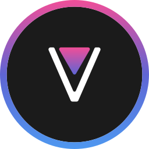

  <picture>
    <source
      width="256px"
      media="(prefers-color-scheme: dark)"
      srcset="assets/revanced-headline/revanced-headline-vertical-dark.svg"
    >
    
  </picture>
   
  <a href="https://revanced.app/">
     <picture>
         <source height="24px" media="(prefers-color-scheme: dark)" srcset="assets/revanced-logo/revanced-logo.svg" />
         
     </picture>
   </a>&nbsp;&nbsp;&nbsp;
   <a href="https://github.com/ReVanced">
       <picture>
           <source height="24px" media="(prefers-color-scheme: dark)" srcset="https://i.ibb.co/dMMmCrW/Git-Hub-Mark.png" />
           
       </picture>
   </a>&nbsp;&nbsp;&nbsp;
   <a href="http://revanced.app/discord">
       <picture>
           <source height="24px" media="(prefers-color-scheme: dark)" srcset="https://user-images.githubusercontent.com/13122796/178032563-d4e084b7-244e-4358-af50-26bde6dd4996.png" />
           
       </picture>
   </a>&nbsp;&nbsp;&nbsp;
   <a href="https://reddit.com/r/revancedapp">
       <picture>
           <source height="24px" media="(prefers-color-scheme: dark)" srcset="https://user-images.githubusercontent.com/13122796/178032351-9d9d5619-8ef7-470a-9eec-2744ece54553.png" />
           
       </picture>
   </a>&nbsp;&nbsp;&nbsp;
   <a href="https://t.me/app_revanced">
      <picture>
         <source height="24px" media="(prefers-color-scheme: dark)" srcset="https://user-images.githubusercontent.com/13122796/178032213-faf25ab8-0bc3-4a94-a730-b524c96df124.png" />
         
      </picture>
   </a>&nbsp;&nbsp;&nbsp;
   <a href="https://x.com/revancedapp">
      <picture>
         <source media="(prefers-color-scheme: dark)" srcset="https://user-images.githubusercontent.com/93124920/270180600-7c1b38bf-889b-4d68-bd5e-b9d86f91421a.png">
         
      </picture>
   </a>&nbsp;&nbsp;&nbsp;
   <a href="https://www.youtube.com/@ReVanced">
      <picture>
         <source height="24px" media="(prefers-color-scheme: dark)" srcset="https://user-images.githubusercontent.com/13122796/178032714-c51c7492-0666-44ac-99c2-f003a695ab50.png" />
         
     </picture>
   </a>
    
    
   Continuing the legacy of Vanced

# 🖌️ ReVanced brand guidelines

This repository contains guidelines, kits, and other assets to help you use ReVanced's core brand elements.

> [!NOTE]
> Specifications are in their early stage of development and might heavily change a lot in their first revisions.

## 🖼️ ReVanced logo

### 🚩 The basics

The ReVanced logo is the most recognizable asset, which is why it is important to follow certain rules when used:

- Do not alter, rotate, or modify the logo. Exceptions apply below
- Do not animate the logo
- Use the latest revision of the logo available at all time

### 🎨 Colors

The ReVanced logo has a triadic gradient that defines its character. The ring as well as the logo feature a top-to-bottom gradient blending the colors  `#F04E98`,  `#5F65D4`, and  `#4E98F0` on the background color  `#1B1B1B`.

The ReVanced logo should appear in single shades of black and white, but the diamond may appear in any color. A light shade and vice versa should be used on a dark background.

### 📏 Spacing

The ReVanced logo should have a minimum margin of 15% of its original size. If a headline accompanies the logo, the margin of the logo and headline should be increased together.

### ☝️ Headline

The ReVanced logo should be accompanied by a headline of any typeface, preferably [Manrope](assets/revanced-typeface/manrope), starting with the [wordmark](assets/revanced-wordmark) on the right or below the logo only.

The headline should appear in single shades of black and white. A light shade and vice versa should be used on a dark background. The full ReVanced logo should be used with a headline.

### 🌐 Socials

Any border-radius may be used for the ReVanced logo.

### ❌ Misuse

- Don't add additional gradients
- Don't add special effects
- Don't change orientation
- Don't add drop shadows
- Don't add additional elements
- Don't add patterns or textures
- Don't skew, rotate, or stretch
- Don't change color
- Don't accompany the logo with a headline starting with anything other than the wordmark
- Don't overemphasize the logo
- Don't place the logo or a variant on a background with low contrast

### 🔨 Application

The ReVanced logo offered by the official method should be use no matter which Operating System (OS) it is, 
however certains exceptions like the sizing and positioning of the application which varies platform-to-platform, 
then you may use your own OS-specific guidelines for positioning an application as long as the recognizability of 
the distinct shape of the ReVanced logo (the entire V-shape) isn't hampered by the OS designs or other arbitrary changes.

As for sizing, the V-shape should not be too small or too big compared to other application, you may "use" the official the grid 
if exist to provide preliminary assessment, optical sizing can be use instead of precise grid and/or mathematical sizing to 
provide equally consistent experience with the rest of the system.

The logo should be visible with adequate constrast as possible with these filter:
* Colored
* Greyscale (If the OS supports customizable tinting and/or layered effect)
* Monochrome (If the OS supports light tinting and/or monochromic effect)

#### Extended features

The concept of layering like _Adaptive icons in Android_ or _(2D/3D) Layer design in Apple_ should put  
the foreground of the application icon the entire V-shape in the *first in order* then comes the color background 
which uses the same color as the official background palette  `#1B1B1B`

Monochromic or greyscale should use the exact sizing and positioning as the colored variant of the application icon,
monochromic icon should be in one color either white or black (in this guidelines) or depending on OS requirements,
greyscale should be in two shades of black with the V being black and the colored triangle being lighter shade of black

In event of the icon being forced to adapt new changes then you may apply that change to the icon without approval
if the OS changed the icon in upcoming change and the resulted icon is exceptionally bad. However you should have
ample enough time to react so it's best to discuss with the branding team first.

## 🔤 ReVanced marks

The ReVanced marks include but are not limited to

- The ReVanced name
- The ReVanced logo
- Anything that includes ReVanced in the name

> [!IMPORTANT]
> No letter except R and V in "ReVanced" should be capitalized.

## 📜 ReVanced tagline

The following taglines should be used whenever a slogan, summary, or short description of ReVanced is required:

- "Continuing the legacy of Vanced"
- "Continuing the legacy of Vanced at revanced.app"

> [!NOTE]
> The tagline may end with punctuation when necessary.
